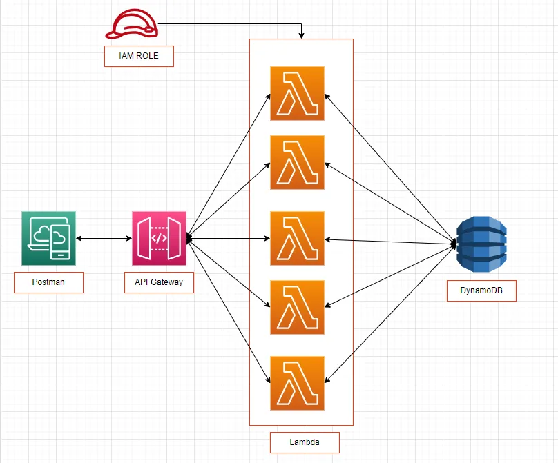
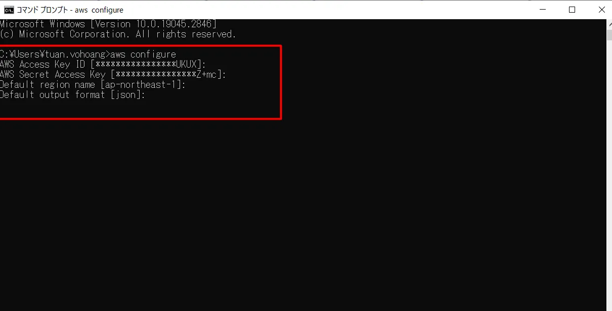
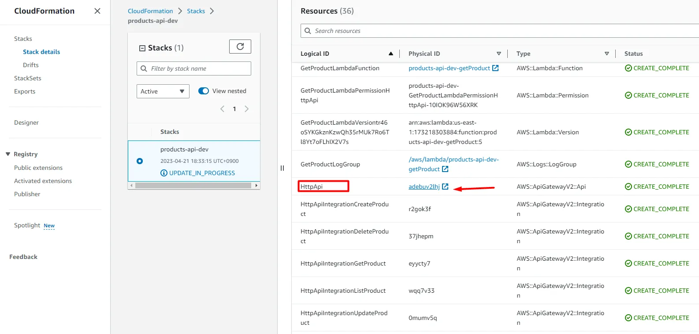
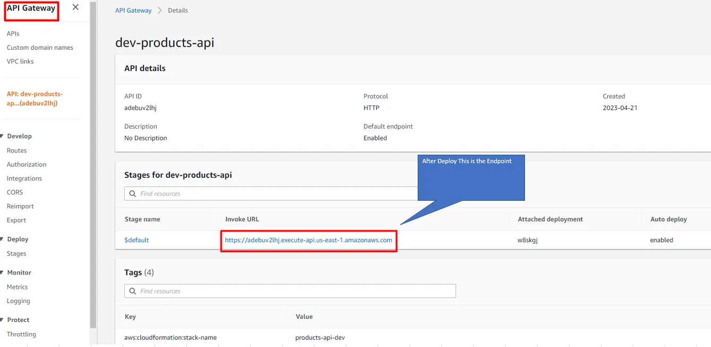
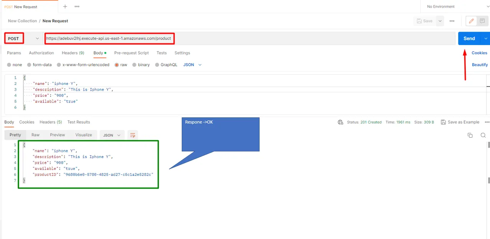
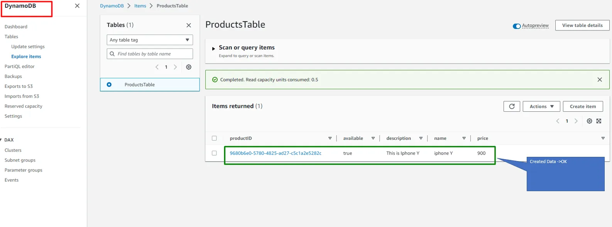

# Serverless REST API

How to Build a Serverless REST API with Node.js, TypeScript, and AWS DynamoDB



## Prerequisites

AWS CLI installed and configured



## Build and Deploy

Clone the project

```bash
  git clone https://github.com/ChamomileTommy/aws-serverless-product-restfulAPI.git
```

Go to the project directory

```bash
  cd aws-serverless-product-restfulAPI
```

Install dependencies

```bash
  npm install
```

Deploy

```bash
  serverless deploy
```

## Endpoints of API

- POST /product - creates new product with autogenerated UUID as ProductID
- GET /product/{uuid} - gets a product by UUID
- PUT /product/{uuid} - updates a product by UUID
- DELETE /product/{uuid} - deletes a product by UUID
- GET /products - gets a list of products

## Demo and Test

Get and copy API Endpoint




Postman test



DynamoDB confirm



## 🚀 About Me

I'm a full stack developer for 4 years
